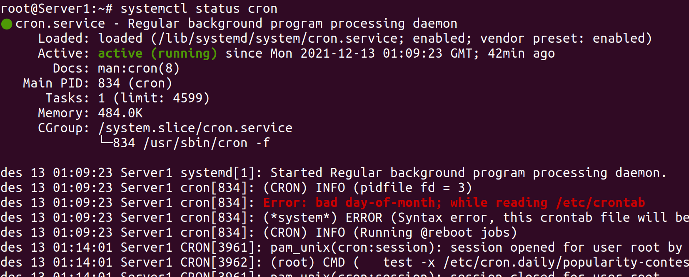
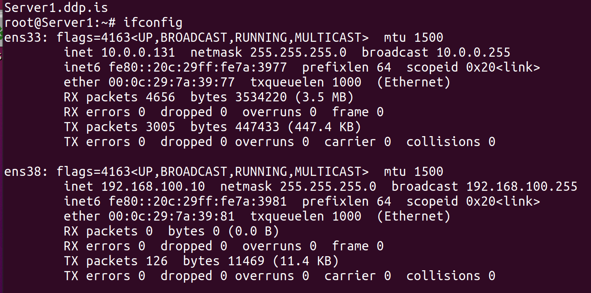
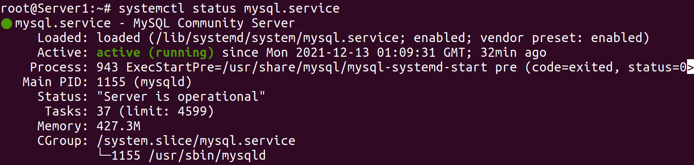
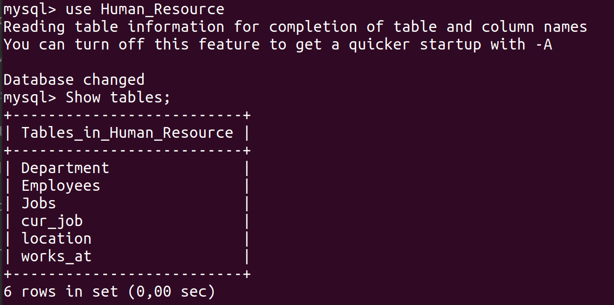
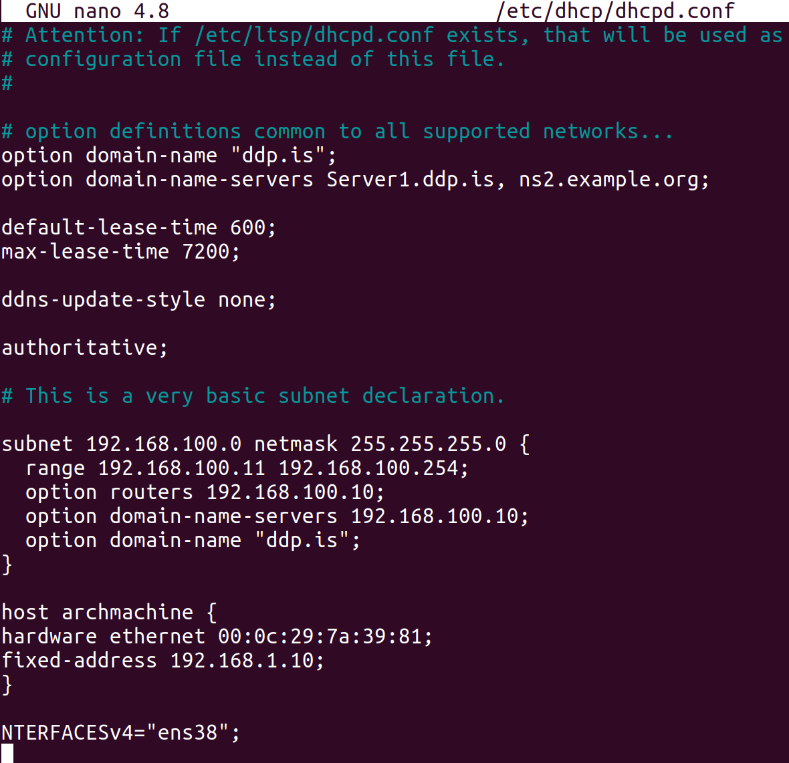
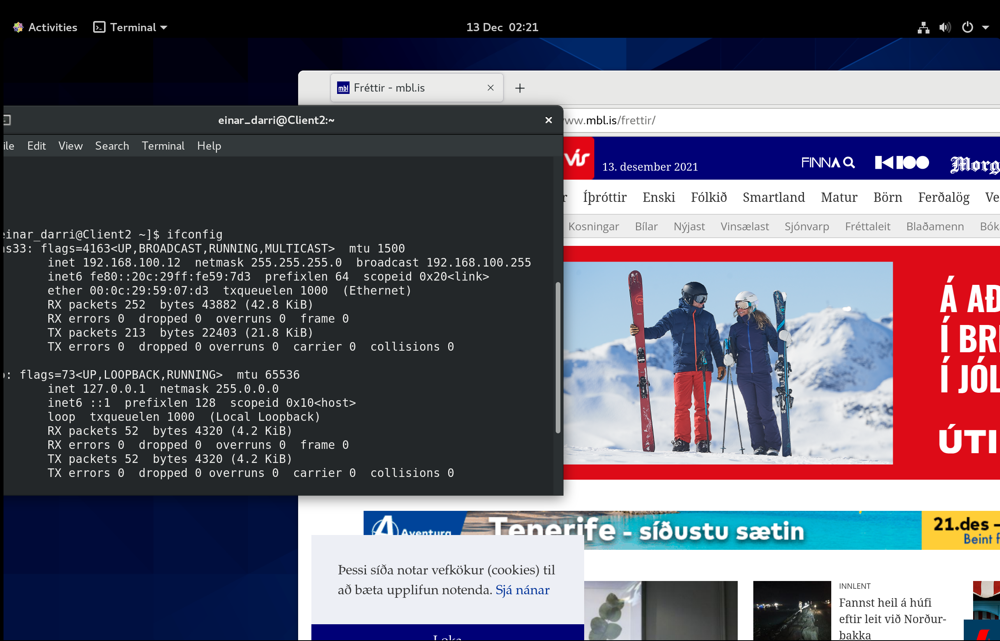
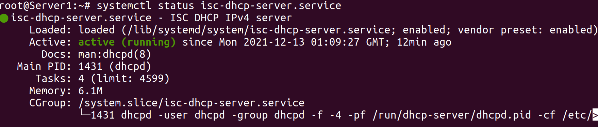
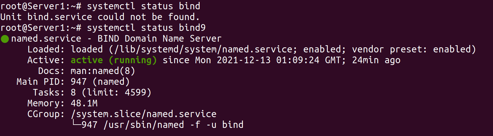

# KEST-linux-lokaverk
## Screenshots:
### Crond status

### Hostname and IP address

### MySQL status

### SQL databases

### dhcp.conf

### Mail test

### NTP status

### NTPQ

### Client 1

### Client 2

### DHCP running

### Bind running


## Lab Instractions:
  1. ~~Install and configure the server1, client1 and client2 with hostnames and domain as ddp.is~~
  2. ~~configure the server1 with static IP Address, from the IP Address block 192.168.100.0/24. The server must be configured with the 10th usable IP Address.~~
  3. ~~Install and configure DHCP on server1, so both clients get an IP Addresses, Gateway, DNS IP address and domain name automatically via HDCP.~~
  4. ~~Install and configure DNS server on server1, so Hostnames are resolved to IP Addresses.~~
  5. ~~Create the users accounts using a script, see the Users file.~~
  6. ~~Install and configure MySQL on server1 and create Human Resource database. The database stores information about employees, employees are identified by their Kinnitala, firtsname, lastname, email, phone number, hire date and salary. Employees work in departments each department has one manager, departments are identified by department ID, department name. Each department is in different location. Locations are identified by their location ID, city, address and zip code. One or more employees’ woks on different jobs, and the jobs are identified by job ID, job title, min salary and max salary.~~
  7. ~~Due to data loss the company policy requires taking backups weekly, as system engineer you are required to schedule backups of home directories to run weekly at midnight each Friday.~~
  8. ~~Install and configure NTP on the server and clients, server1 must be master server to synchronize the time of the clients.~~
  9. install and configure syslog server on server1, server1 should get logs from both the clients for proactive management and monitoring.
  10. ~~Install and configure Postfix on server1, so users can send and receive emails using Roundcube open source software.~~
  11. Install and configure shared printers for each group, only users that belong the group should print only, accept IT and Management groups should print and manage the printers. 
  12. For security reasons, install and configure SSH on the server and clients, SSH login should use RSA keys instead of the password authentication.
  13. All unused ports should be closed, use NMAP for testing.
## User create script:
[create_users.sh](create_users.sh)
```bash
#!/bin/bash
# Author: Ragnar & Einar
# ------------------------------------------
INPUT=Linux_Users.CSV
OLDIFS=$IFS # Keep the old seperator for to change back later
IFS=','
[ ! -f $INPUT ] && { echo "$INPUT file not found"; exit 99; } # if input is not a file
while read name Fname Lname Uname email dprt eID
do
    grpID=$(cut -d: -f3 < <(getent group $dprt))
    useradd -g $grpID -m -u $eID -c "$name" $Uname
    echo -e "pass123\npass123" | passwd $Uname
    echo "┌────────────────────────────────────────────────────"
    echo "│  User $Uname created"
    echo "│  User detail table"
    echo "├─────────────┬──────────────────────────────────────"
    echo "│ Name        │ $name"
    echo "├─────────────┼──────────────────────────────────────"
    echo "│ First name  │ $Fname"
    echo "├─────────────┼──────────────────────────────────────"
    echo "│ Last name   │ $Lname"
    echo "├─────────────┼──────────────────────────────────────"
    echo "│ Username    │ $Uname"
    echo "├─────────────┼──────────────────────────────────────"
    echo "│ Email       │ $email"
    echo "├─────────────┼──────────────────────────────────────"
    echo "│ Department  │ $dprt - $grpID"
    echo "├─────────────┼──────────────────────────────────────"
    echo "│ Employee ID │ $eID"
    echo "└─────────────┴──────────────────────────────────────"
done < $INPUT
IFS=$OLDIFS
```

## SQL database:
```mysql
create database Human_Resource;
use Human_Resource;

create table Employees
(
kennitala int,
firstName varchar(55),
lastName varchar(55),
email varchar(75),
phonenumber char(7),
hire_date date,
salary int,
constraint Employees_Pk primary key(kennitala)
);

create table location
(
ID int auto_increment,
city varchar(75),
zipcode varchar(32),
constraint Location_PK primary key(ID)
);


create table Department
(
ID int auto_increment,
manager int,
name varchar(75),
location int,
constraint Department_Pk primary key(ID),
constraint Manager_Fk foreign key(manager) references Employees(kennitala),
constraint Location_Fk foreign key(location) references location(ID)
);

create table works_at
(
ID int auto_increment,
Employe int,
department int,
constraint Work_at_Pk primary key(ID),
constraint Employe_Fk foreign key(Employe) references Employees(kennitala),
constraint Department_Fk foreign key(department) references Department(ID)
);

create table Jobs
(
ID int auto_increment,
title varchar(125),
max_salary int,
min_salary int,
constraint Job_Pk primary key(ID)
);

-- Stands for current job
create table cur_job
(
ID int auto_increment,
Employe int,
Job int,
Salary int,
constraint Curent_Job_PK primary key(ID),
constraint Empolye_FK foreign key(Employe) references Employees(kennitala),
constraint Job_FK foreign key(Job) references Jobs(ID)
);
```
